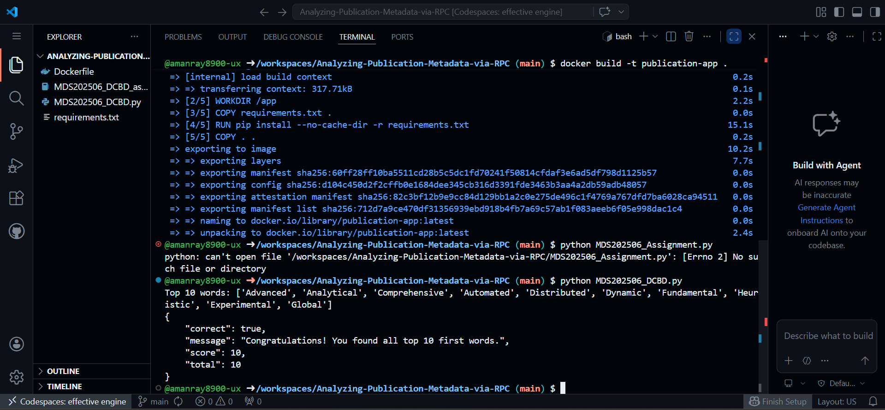

# 📊 Analyzing Publication Metadata via RPC

This project analyzes publication metadata using Python and demonstrates containerization using Docker.

---

## 🚀 Project Overview

The objective of this project is to:

* Process and analyze publication metadata
* Implement the logic using Python
* Containerize the application using Docker
* Export the Docker image as a `.tar` file

---

## 📁 Project Structure

```
.
├── MDS202506_Assignment.py   # Main Python script
├── requirements.txt          # Python dependencies
├── Dockerfile                # Docker configuration
├── output.png                # Screenshot of output
└── README.md                 # Documentation
```

---

## ⚙️ Requirements

* Python 3.x
* Docker

---

## 📦 Installation & Setup

### 1. Clone the repository

```bash
git clone https://github.com/SambitGhub/Analyzing-Publication-Metadata-via-RPC.git
cd Analyzing-Publication-Metadata-via-RPC
```

---

### 2. Install dependencies

```bash
pip install -r requirements.txt
```

---

### 3. Run the Python script

```bash
python MDS202506_Assignment.py
```

---

## 🐳 Docker Setup

### 1. Build Docker image

```bash
docker build -t publication-app .
```

---

### 2. Run Docker container

```bash
docker run -it publication-app
```

---

### 3. Export Docker image as `.tar`

```bash
docker save -o publication-app.tar publication-app
```

---

## 📸 Output Screenshot

Below is a sample output of the application:



---

## 📤 Output

* Application runs successfully inside Docker
* Docker image exported as:

```
publication-app.tar
```

---

## 💡 Notes

* Ensure `requirements.txt` contains all dependencies
* Make sure Python script runs without errors before Docker build
* Dockerfile runs:

```bash
python MDS202506_Assignment.py
```

---

## 👨‍💻 Author

**AMAN RAY**
MSc Data Science
Chennai Mathematical Institute

---

## 📌 Submission Checklist

* ✅ Python script
* ✅ Dockerfile
* ✅ requirements.txt
* ✅ Docker image (.tar file)
* ✅ README.md
* ✅ Output screenshot

---
